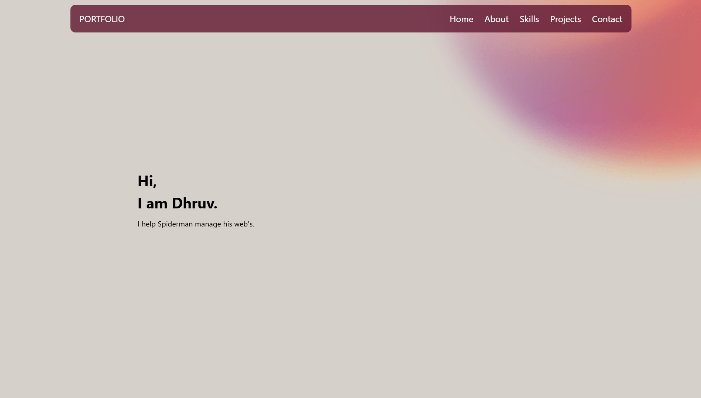

# 🌐 My Web Developer Portfolio

Welcome to my personal web developer portfolio! This project showcases my skills, experience, and the work I've done as a web developer, including Web3 and blockchain-based projects.

## 🚀 Live Demo

🔗 [View Portfolio Live](https://dhruvfromearth.github.io/MyPortfolio/)

## 📁 About the Project

This is a responsive, modern portfolio website built to highlight:

- My background in web development
- Projects I've worked on (including Web3 & blockchain)
- My technical skill set
- Contact information and links to my social media/GitHub

## 🛠️ Tech Stack

- HTML5, CSS3, JavaScript
- Framework/library used: React
- Vite (for fast bundling and development)

## 📸 Screenshots

## 📬 Contact

I'm always open to new opportunities, collaborations, or just a friendly chat about web development and technology.

- **Email:** [your.email@example.com](mailto:dhruvjaindj888@gmail.com)  
- **LinkedIn:** [linkedin.com/in/yourprofile](https://www.linkedin.com/in/dhruvjaindj888/)

Feel free to reach out — I'd love to connect!

---

Thank you for checking out my portfolio! ⭐️